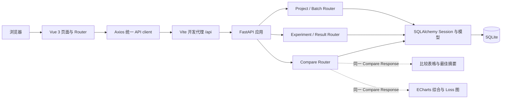
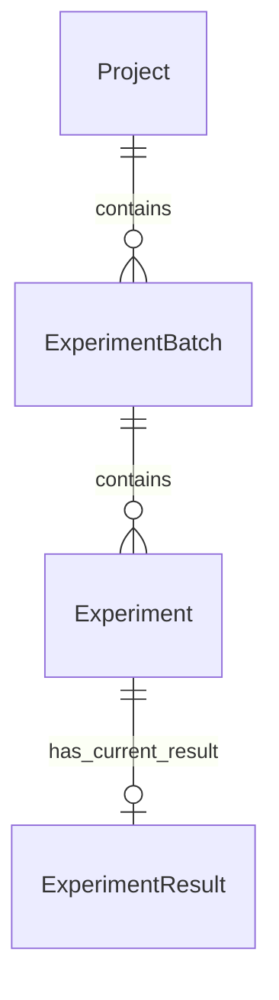

# AIExpHub 整体设计

本文面向课程审阅者和后续维护者，描述截至阶段 6A 的实际实现。系统用于 AI / 机器学习实验结果管理与可视化，不执行训练或生成式 AI 分析。本文不改变阶段 2.5 冻结的业务规则，不代表阶段 6B 最终验收通过。

## 1 项目背景与目标

课程第 14 题要求记录模型、实验参数和评价指标，保存实验结果并支持多实验对比。AIExpHub 将项目、批次、单次实验和当前结果组织为稳定层级，让使用者完成“记录配置 → 保存结果 → 查询 → 比较 → 可视化”的流程。数据来自用户实际录入，首页不展示没有聚合 API 支撑的统计数字。

原文把 AI 自动比较、参数变化总结、报告生成列为可选扩展。项目中的 AI 是实验管理的对象，也体现 AI 辅助软件开发的过程，当前业务产品没有接入大模型。

## 2 需求分析

必做需求为项目创建、批次管理、模型 / 参数记录、结果指标、实验列表 / 详情和多实验结果比较。当前另提供项目、批次与实验的编辑和受控删除，以及综合指标图和独立 Loss 图，满足指标对比与最佳结果展示。

使用者先选择项目和批次，再维护实验与结果；比较页允许从不同项目与批次加入实验。实验可以没有结果，已录入结果必须至少一项有效指标。第一版没有用户、权限、标签、附件、训练任务、统计 Dashboard 或导出功能。详情通过实验列表中的配置列和所选实验的结果区展示，同时后端提供独立详情接口，没有另建详情页面路由。

[需求边界](requirements.md)、[领域模型](domain-model.md)、[校验规则](validation-rules.md)保留阶段 2.5 的设计基线与当时范围文字；具体已实现行为以本文及 [API 文档](api.md) 为准。历史阶段中的“未实现 / 后续确定”不是当前运行状态。

## 3 系统总体架构

开发时浏览器请求同源 `/api`，Vite 转发到 `127.0.0.1:8000` 并移除前缀；后端实际路径没有 `/api` 前缀。该代理是开发服务器配置，不是已经交付的生产部署方案。后端没有新增 CORS 或认证中间件。ECharts 在浏览器本地消费响应，不另发结果请求。

FastAPI 启动 lifespan 注册 ORM 并调用 `create_all`，退出 dispose engine；健康检查执行 `SELECT 1`。各业务请求通过 `get_db` 获得独立 Session，写入显式 commit，数据库完整性失败 rollback，结束关闭 Session。

## 4 技术选型

| 层次 | 实际技术 | 选择依据与边界 |
| --- | --- | --- |
| 前端 | Vue 3、Vite、TypeScript、Vue Router、Axios | 支持表单、路由、明确请求响应类型与本地构建；不增加状态管理框架 |
| UI | Element Plus | 表单、Dialog、Table、Card、消息和删除确认；当前全量注册 |
| 图表 | ECharts 6.1.0，Canvas，按模块引入 | 四指标分组柱、独立 Loss、Tooltip 与最佳标识；无包装库 |
| 后端 | Python 3.12、FastAPI、Uvicorn、Pydantic v2 | 请求校验、response_model、OpenAPI 与本地运行 |
| 数据层 | SQLAlchemy 2.x、SQLite | ORM 关联与约束、单文件本地持久化，适合课程演示；无迁移工具 |
| 测试 | pytest、httpx、FastAPI TestClient | 覆盖实际 HTTP 层及数据库约束，独立临时文件隔离 |

后端实际固定版本见 [requirements.txt](../backend/requirements.txt) 和 [requirements-dev.txt](../backend/requirements-dev.txt)，前端版本与锁文件见 [package.json](../frontend/package.json) 和 [package-lock.json](../frontend/package-lock.json)。6A 未安装或升级依赖。

## 5 系统模块设计

| 模块 | 后端职责 | 前端职责 |
| --- | --- | --- |
| 健康与首页 | `/health` 检查数据库连接 | Hero、三个功能入口、自动 / 手动检测及不可用状态 |
| 项目 / 批次 | `projects.py` / `batches.py` CRUD、父关联、删除 RESTRICT | 项目列表与所属批次 Card、名称表单、删除确认、进入实验管理 |
| 实验 / 结果 | `experiments.py` / `results.py` 编号、参数、当前结果、校验与事务 | 层级选择、实验列表 / 表单、结果详情 / 表单、区分未录入与请求失败 |
| 比较 | `compare.py` 单条 SELECT、保持输入顺序、每项最佳值 | 候选、跨上下文已选列表、比较响应、表格与图表 |
| 公共设施 | `database.py`、`models.py`、`schemas.py` | api client 与实体类型、errors.ts、datetime.ts、Router、通用 CSS |

没有额外 service / repository 层，当前规模直接在 Router 使用 Session 足够；不为了分层新增空壳模块。Compare Router 先于 `/experiments/{experiment_id}` 注册，避免 compare 被解释为动态 ID。

## 6 数据模型设计

| 实体 / 表 | 属性 | 约束与职责 |
| --- | --- | --- |
| Project / projects | id、name、description、created_at | 整数主键；名称非空，名称不唯一；项目组织批次 |
| ExperimentBatch / experiment_batches | id、project_id、name、description、created_at | 非空 Project 外键；名称必填、description 可空；父删除 RESTRICT |
| Experiment / experiments | id、batch_id、experiment_no、model_name、parameters、created_at、notes | Batch 外键；编号全局 UNIQUE；JSON 参数；不重复保存 project_id |
| ExperimentResult / experiment_results | id、experiment_id、accuracy、precision、recall、f1、loss、updated_at | experiment_id UNIQUE 与 CASCADE；各指标可 NULL，至少一项非 NULL，六个 CHECK |

Project 1:N Batch、Batch 1:N Experiment，父可以没有子记录。Experiment 1:0..1 Result：可以先建实验，首次录入后只有一份当前结果，后续更新，不创建历史版本。每个子必须有真实父资源。

[models.py](../backend/app/models.py) 使用双向 `back_populates`；父端 `passive_deletes="all"` 让 SQLite 执行删除约束，包括 ORM 已加载子记录的情况。每个连接启用 `PRAGMA foreign_keys=ON`。parameters 使用 `JSON(none_as_null=True)`，API 校验非空对象；数据库并未增加 JSON shape CHECK。编号的 trim / uppercase 在应用 Schema 层完成，数据库 UNIQUE 对规范化后的存储值提供第二层保护。

日期为系统 UTC、SQLite 中无偏移的 DateTime，前端按 UTC 解释。结果真实 ORM 修改触发 updated_at 的 onupdate；相同值 PUT 不保证刷新时间，原生 SQL 更新不执行 ORM onupdate。`create_all` 只创建缺失表，不迁移已有结构。

## 7 API 设计

| 资源 | 现有路径与方法 | 主要行为 |
| --- | --- | --- |
| 健康 | GET `/health` | 正常 200，数据库不可用 503 |
| Project | POST / GET `/projects`；GET / PUT / DELETE `/projects/{id}` | 创建 201，读取 / 更新 200，删除 204 |
| Batch | POST / GET `/projects/{id}/batches`；GET / PUT / DELETE `/batches/{id}` | URL 确定父项目，不允许移动所属项目 |
| Experiment | POST / GET `/batches/{id}/experiments`；GET / PUT / DELETE `/experiments/{id}` | 批次内列表，不提供全局列表，不允许迁移 Batch |
| Result | POST / GET / PUT `/experiments/{id}/result` | 首次 POST；PUT 只替换已有结果，不 upsert；无独立 DELETE |
| Compare | POST `/experiments/compare` | 只读比较，200 响应含 experiments 与 best_by_metric |

输入 Schema 拒绝额外字段；列表按 id ASC，不提供分页或搜索。PUT 为完整更新：description / notes 省略或 null 清空；Result 省略指标同 null，更新后仍不得全空。父 ID、内部 ID 和创建时间不作为可编辑 Body 字段。

详细输入、输出、状态码和示例以 [api.md](api.md) 及 `/docs` 为准。接口不是训练执行服务，不增加 API key、登录或 AI 调用。

## 8 核心业务规则

- 项目 / 批次名称、model_name 和 experiment_no 必填，trim 后非空；编号再 uppercase，用户输入、非固定格式、全系统唯一，更新排除自身。
- parameters 必须提供且为非空 JSON object，拒绝 null、数组、字符串、数字、布尔值和空对象；不要求固定键，不验证特定学习率等参数值。
- Result 的 accuracy / precision / recall / f1 在 [0,1]；loss ≥ 0；所有非空指标是有限整数 / 浮点数，拒绝 bool、字符串和 NaN / ±Infinity。
- Result 可以部分为 null，但至少一项有效；0 合法。非法更新不能覆盖原有效数据。
- Project 有 Batch、Batch 有 Experiment 时拒绝删除；Experiment 删除级联 Result，不制造孤立结果。
- 跨项目与批次比较至少两个不同真实实验；不因缺失结果或单项指标伪造数值。最新结果、并列与比较方向遵循下节。

没有新增名称唯一、固定参数键、固定实验编号格式等规则。冻结规则逐项测试映射见 [acceptance-matrix.md](acceptance-matrix.md)。

## 9 前端交互设计

Router 提供首页、项目管理、实验管理、实验比较及 catch-all 404，afterEach 设置浏览器标题。首页使用功能介绍和真实 health；三个入口为真实 Element Plus Button。导航有 nav、active、hover、focus-visible 与窄屏换行。

项目页上下两张 Card 管理项目与所选批次，未选项目不请求批次。实验页项目 → 批次 → 实验选择；父切换清空子选择，列表不逐项取 Result，仅查看 / 新建选中实验时读取结果。批次行可携带 projectId / batchId 跳转，非法或归属不符时回退选择。

各页面用请求序号丢弃过期响应，使用加载与提交状态抑制重复操作；删除需确认并说明级联。比较页跨项目 / 批次保留已选项、按 ID 去重，选择变化清空旧比较，失败保留选择但清空旧结果。重新比较期间遮罩，成功后同时更新摘要、表格和图；在另一页修改结果不会自动推送，需点击重新比较读取新值。

公共标题、Card 和操作区样式集中在 style.css；业务页最大宽 1200px，首页内部最大 1040px，窄屏保留表格滚动。保留表格 / 图表 aria-label、健康 aria-live 和明确空状态。5B iframe 视口结果不等于实际窗口拖动最终验收。

## 10 实验比较算法

输入 `experiment_ids` 必须为至少两个不同严格正整数。任何实验缺失，按请求顺序报首个缺失 ID 的 404，不部分成功。

`compare_experiments` 使用 `select(Experiment)` 和 joinedload 一次加载实验、批次、项目及可选结果，建立 ID 映射后按输入顺序构造 experiments。结果字段缺失为 null，没有结果时 result=null。对五项指标分别取非 null 的 `(id, value)` 候选：四项取 max，loss 取 min；无候选返回 `value=null, experiment_ids=[]`；所有等于最佳值的 ID 按输入顺序返回。

比较按存储 float 的实际大小和相等判定，不 round、不使用 epsilon 或百分比。固定五项扫描的计算量随所选实验数线性增长；这不是经过性能压测的容量声明。每个请求重新读取当前 Result，不 commit、不写表、不保存历史或缓存。响应只含 `experiments` 和 `best_by_metric`，由 response_model 约束。

对应 [test_compare.py](../backend/tests/test_compare.py) 验证 null、0、跨上下文、并列、顺序、更新可见性、精确浮点行为，以及一次 SELECT / 无 commit / 表内容不变。前端每次一次 Compare POST，没有逐实验 Result GET。

## 11 可视化设计

四项 [0,1] 指标使用分组柱状图，Y 轴固定 0–1；Loss 使用独立柱图，Y 轴从 0 起自动上界。Loss 没有固定 1 上界，与其他指标同轴会造成尺度误导，因此分开。

横轴编号保持响应顺序，长编号旋转并截断；Tooltip 显示完整编号、模型和原始指标。null 不画成 0，0 保留真实值；全部缺失时各图独立空状态。柱顶最佳标签完全来自后端 best_by_metric，允许并列，loss=0 的标签仍在零轴上方。前端不归一化、不改成百分比、不自行计算最佳。

ComparisonCharts 只接收比较页同一响应的 props；复用两张图的实例，`setOption(notMerge)` 更新，ResizeObserver 调用 resize，卸载 disconnect / dispose。阶段 5A AA 的实际浏览器窗口调整必须在 6B 人工补测，包括恢复宽度、单个 canvas、轴标签和控制台。

## 12 异常处理

Schema 输入非法返回标准 422 detail；资源不存在 404；重复编号 / 首次结果重复 / 删除受限或完整性冲突 409。数据库失败先 rollback，不暴露 SQL traceback。非有限值出现在校验错误回显时转为文本，避免 JSONResponse 序列化再次失败。

前端 errors.ts 按后端 detail、422 数组及网络异常转换为中文，沿用每页局部处理，没有全局 interceptor。Experiment 存在但未录入 Result 的特定 404 显示业务空状态；实验不存在时清理选择并刷新。后端停止时首页显示不可用，静态入口与导航仍可用；业务页提示无法连接，恢复后刷新 / 检测。

## 13 测试策略

现有 102 个 pytest：原实体 / 健康 / 数据约束 60 个，以及比较 42 个。包含 API HTTP 层的响应、失败不破坏状态、合法边界、重复与关联，以及 ORM 绕过 Schema 时的 UNIQUE / CHECK / RESTRICT / CASCADE 第二层保护。

[conftest.py](../backend/tests/conftest.py) 为每个测试使用 tmp_path 下独立 SQLite、启用 foreign_keys、创建临时表；get_db dependency override 和 health Session 指向临时数据库。不启动生产 lifespan，生产 engine / init_db 连接守卫防误用；用后关闭 client、清空 overrides 并 dispose engine。因此自动测试不接触运行数据库。没有 coverage 报告，不宣称 100% 覆盖。

前端 build 执行 vue-tsc 再 Vite；没有前端测试框架。既有真实 HTTP 与浏览器流程见审计文档历史记录，6B 再进行最终真实操作。6A 本次：pip check 正常；102 passed、0 failed、1 warning、7.15s；build 0 类型 / 构建错误，保留 chunk warning；四表 0，生产数据库保持原文件。6A 没有创建验收数据或录制视频。

## 14 AI 辅助开发流程

开发使用本聊天中的 Codex。使用者确定选题、规则和小阶段范围，AI 检查仓库、设计 / 编码、运行测试和验证，阶段成果独立提交后才继续。Git 从初始化、规则冻结、数据库、API、pytest、前端、比较到图表和 UI 有可追溯提交。

详见 [ai-assisted-development.md](ai-assisted-development.md)，包含关键指令摘要、提交映射和真实校验 / 比较 / N+1 / 图表案例。人工负责规则选择、阶段范围与推进；AI 工具执行的测试不冒充学生逐行代码审查或教师最终确认。

## 15 当前限制与后续扩展

当前是课程实践平台：本地 SQLite、create_all 无 Alembic、无认证、无比较历史 / 结果历史、无 AI 自动分析、无统计 / 导出 / 训练调度，Element Plus / ECharts 的 >500 kB warning 保留。没有生产部署、高并发或完整安全验证。

下一步仅按已计划的 6B 完成真实窗口补测、最终流程验收、学生讲解及演示交付。迁移、认证、生成式 AI 等扩展只有另行确认后才讨论，不属于本阶段补齐功能。
