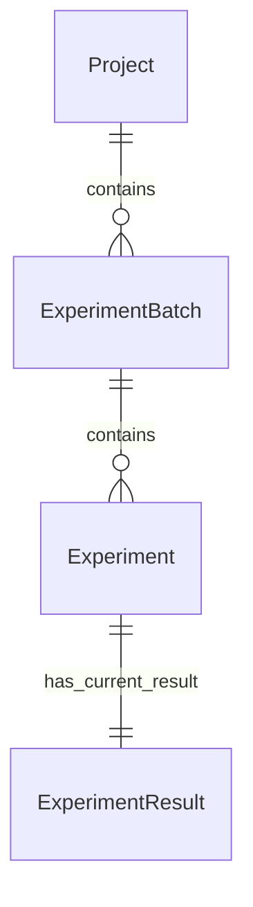

# 领域模型

当前阶段：阶段 2，领域模型与业务规则定稿。本文件描述第一版的业务实体与关系，不包含数据库表、ORM、接口或页面实现。属性是领域层面的暂定名称，不代表已经确定数据库字段类型。

## 核心关系



- 一个 Project 可以包含多个 ExperimentBatch，也可以暂时没有批次；每个批次必须属于一个存在的项目。
- 一个 ExperimentBatch 可以包含多个 Experiment，也可以暂时没有实验；每个实验必须属于一个存在的批次。
- Experiment 与 ExperimentResult 的目标关系为 1:1。每份结果必须属于一个存在的实验，每个实验只有一份当前有效结果。
- 修改结果时更新该实验的当前结果，不新增重复结果。第一版不设计结果版本历史。
- 实验所属项目通过批次确定，暂不在 Experiment 中重复设置 `project_id`，避免两处关联不一致。

这里的 1:1 描述完整实验的领域关系。是否允许先保存尚未录入结果的实验、实验与结果如何完成首次保存，仍需在后续实现前明确；本阶段不把无结果草稿视为已确认功能，也不将目标关系改成 1:N。

## Project 实验项目

**职责：**组织一个完整实验研究项目，例如“Janus-Pro 空间推理实验”。

| 暂定属性 | 含义 | 当前约定 |
| --- | --- | --- |
| `id` | 内部稳定标识 | 用于实体关联，具体类型后续确定。 |
| `name` | 项目名称 | 必填，不能是空字符串或仅含空白字符。 |
| `description` | 项目说明 | 暂定可选。 |
| `created_at` | 创建时间 | 暂定由系统记录。 |

**关系：**Project 1:N ExperimentBatch。项目名称的唯一性未作要求，不将其视为唯一标识。

## ExperimentBatch 实验批次

**职责：**组织项目中的一次实验批次或一组用于比较的实验，例如“不同干预方式对比实验”。

| 暂定属性 | 含义 | 当前约定 |
| --- | --- | --- |
| `id` | 内部稳定标识 | 用于实体关联。 |
| `project_id` | 所属项目标识 | 必须指向一个存在的 Project。 |
| `name` | 批次展示名称 | 暂定保留；是否必填尚待确认。 |
| `description` | 批次说明 | 暂定可选。 |
| `created_at` | 创建时间 | 暂定由系统记录。 |

**关系：**每个批次属于一个 Project，同时可包含多个 Experiment。批次用于组织实验，但跨批次、跨项目是否允许比较尚待确认。

## Experiment 单次实验

**职责：**记录一次具体实验的身份、模型与实验配置。

| 暂定属性 | 含义 | 当前约定 |
| --- | --- | --- |
| `id` | 内部稳定标识 | 用于关联结果，与实验编号分开。 |
| `batch_id` | 所属批次标识 | 必须指向一个存在的 ExperimentBatch。 |
| `experiment_no` | 实验编号 | 必填，在整个系统中全局唯一。 |
| `model_name` | 模型名称 | 必填，不能是空字符串或仅含空白字符。 |
| `parameters` | 实验参数 | 计划采用 JSON 对象，允许不同模型使用不同参数键。 |
| `created_at` | 创建时间 | 暂定由系统记录。 |
| `notes` | 实验备注 | 暂定可选。 |

参数示例：

```json
{
  "learning_rate": 0.0001,
  "batch_size": 32,
  "seed": 42,
  "optimizer": "AdamW"
}
```

示例中的键不是所有模型共同的必填字段。不要求每个模型都提供学习率、批次大小或优化器；参数对象是否必须提供、能否为空对象以及各模型必填项尚待确认。无效 JSON、缺失必要参数的处理应明确，不能静默丢弃或擅自补默认值。

**关系：**每个 Experiment 属于一个 ExperimentBatch，与 ExperimentResult 为 1:1。

`experiment_no` 全局唯一的原因是实现简单、避免实验比较时的编号歧义，并便于自动化测试和课程验收。例如已有 `EXP-001` 时，任何项目或批次都不能再次使用同一编号。编号生成方式及大小写、首尾空白的规范化策略尚待确认；本阶段不实现唯一约束。

## ExperimentResult 实验结果

**职责：**保存某个实验唯一的一份当前有效结果，供详情、比较、统计和图表使用。

| 暂定属性 | 含义 | 当前约定 |
| --- | --- | --- |
| `id` | 内部稳定标识 | 标识当前结果。 |
| `experiment_id` | 所属实验标识 | 必须指向一个存在的 Experiment；同一实验不能有重复当前结果。 |
| `accuracy` | 准确率 | 可为空；提供时必须是 [0, 1] 内的有限数值。 |
| `precision` | 精确率 | 可为空；提供时必须是 [0, 1] 内的有限数值。 |
| `recall` | 召回率 | 可为空；提供时必须是 [0, 1] 内的有限数值。 |
| `f1` | F1 指标 | 可为空；提供时必须是 [0, 1] 内的有限数值。 |
| `loss` | 损失值 | 可为空；提供时必须是大于等于 0 的有限数值。 |
| `updated_at` | 最近更新时间 | 暂定由系统在结果保存或修改时记录。 |

五项指标中至少一项非空。`0` 是合法数值，不等于空值；不能通过新增一份结果绕过修改校验。结果修改后，后续详情、比较、统计与图表必须使用最新结果。

第一版不单独建立模型、参数、用户或指标定义实体。具体校验与异常语义见 [业务校验规则](validation-rules.md)。
